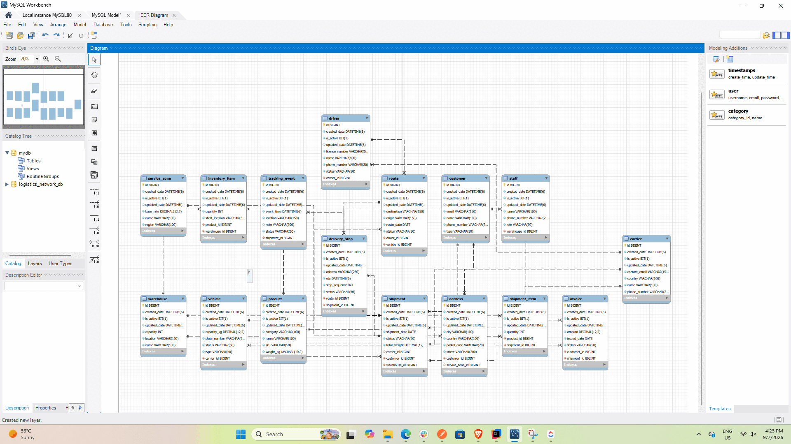

# Logistics Network

A Spring Boot REST API for managing warehouses, inventory, shipments, carriers, routes, delivery stops, tracking events, invoices, and logistics staff.

The project implements full CRUD operations, DTO-based request and response handling, validation, soft deletion, business workflows, custom database queries, statistics, and centralized exception handling.

## Technology Stack

- Java 21
- Spring Boot 4.1.1
- Spring Web MVC
- Spring Data JPA / Hibernate
- MySQL
- Jakarta Bean Validation
- Lombok
- Maven Wrapper
- Postman

## Main Features

- Full CRUD for 16 logistics entities
- Active-record filtering and soft deletion
- DTO conversion for requests and responses
- Validation with clear error messages
- Centralized exception handling
- Type-safe status and category enums
- Shipment creation with automatic inventory deduction
- Carrier assignment
- Route creation with vehicle, driver, and capacity validation
- Ordered delivery stops
- Shipment tracking history
- Automatic shipment and route status updates
- Invoice generation after delivery
- Custom operational queries and statistics

## Domain Entities

1. Warehouse
2. Product
3. Customer
4. Service Zone
5. Carrier
6. Vehicle
7. Driver
8. Inventory Item
9. Address
10. Shipment
11. Shipment Item
12. Route
13. Delivery Stop
14. Tracking Event
15. Invoice
16. Staff

All entities extend a shared `BaseClass` containing:

- `id`
- `isActive`
- `createdDate`
- `updatedDate`

## ERD



Additional database evidence:

- [Database schema screenshot](docs/database-schema.png)
- [Successful Maven build](docs/maven-build-success.png)

## Project Structure

```text
src/main/java/com/codelegends/logistics_network
├── controllers
├── dtos
│   ├── operations
│   └── stats
├── Entities
├── enums
├── exceptions
├── repositories
└── services
```

## Requirements

Before running the application, install:

- JDK 21
- MySQL 8+
- Git
- Postman (optional, for API testing)

Maven installation is not required because the project includes Maven Wrapper.

## Database Setup

Create the database:

```sql
CREATE DATABASE logistics_network_db;
```

The database password is not stored in Git. Supply it through the `DB_PASSWORD` environment variable.

### IntelliJ IDEA

Open:

```text
Run → Edit Configurations → LogisticsNetworkApplication
```

Add this environment variable:

```text
DB_PASSWORD=your_mysql_password
```

Do not commit real credentials to the repository.

## Run the Application

### Windows PowerShell

```powershell
.\mvnw.cmd spring-boot:run
```

### Linux or macOS

```bash
./mvnw spring-boot:run
```

The API runs at:

```text
http://localhost:8080
```

## CRUD API

Every entity resource supports:

| Method | Route | Purpose |
|---|---|---|
| POST | `/api/{resource}` | Create |
| GET | `/api/{resource}` | Get all active records |
| GET | `/api/{resource}/{id}` | Get one active record |
| PUT | `/api/{resource}/{id}` | Update |
| DELETE | `/api/{resource}/{id}` | Soft delete |

Available resource paths include:

```text
warehouses
products
customers
service-zones
carriers
vehicles
drivers
inventory-items
addresses
shipments
shipment-items
routes
delivery-stops
tracking-events
invoices
staff
```

## Business Operations API

| Method | Endpoint | Purpose |
|---|---|---|
| POST | `/api/operations/shipments` | Create a shipment and deduct inventory |
| PUT | `/api/operations/shipments/{shipmentId}/carrier` | Assign a carrier |
| POST | `/api/operations/routes` | Build a route |
| POST | `/api/operations/routes/{routeId}/stops` | Add a delivery stop |
| POST | `/api/operations/shipments/{shipmentId}/tracking-events` | Append tracking information |
| PUT | `/api/operations/delivery-stops/{stopId}/complete` | Complete a delivery stop |
| POST | `/api/operations/shipments/{shipmentId}/invoice` | Generate an invoice |
| GET | `/api/operations/customers/{customerId}/unpaid-invoices` | List unpaid invoices |

## Custom Queries and Statistics

| Method | Endpoint |
|---|---|
| GET | `/api/operations/queries/shipments/status?status=DELIVERED` |
| GET | `/api/operations/queries/inventory/low-stock?threshold=100` |
| GET | `/api/operations/queries/routes?driverId=1&date=2026-09-07` |
| GET | `/api/operations/queries/vehicles/available` |
| GET | `/api/operations/queries/customers/{customerId}/shipments` |
| GET | `/api/operations/stats/warehouses/{warehouseId}` |
| GET | `/api/operations/stats/carriers/{carrierId}` |
| GET | `/api/operations/stats/customers/{customerId}` |

## Error Response

Validation and business errors return a consistent structure:

```json
{
  "status": 400,
  "error": "Bad Request",
  "message": "Description of the problem",
  "timestamp": "2026-09-07T16:00:00"
}
```

The API handles:

- `400 Bad Request`
- `404 Not Found`
- `405 Method Not Allowed`
- `500 Internal Server Error`

## Postman Collections

The `postman` directory contains:

| Collection | Requests |
|---|---:|
| Phase 2 CRUD | 80 |
| Phase 3 DTO CRUD | 80 |
| Phase 4 Operations | 22 |
| Phase 5 Error Cases | 12 |
| **Total** | **194** |

Import the JSON collection files into Postman and confirm that `baseUrl` is:

```text
http://localhost:8080
```

Use test data or a dedicated test database when running CRUD collections because they contain soft-delete requests.

## Build Verification

Run the complete Maven verification:

### Windows

```powershell
.\mvnw.cmd clean verify
```

### Linux or macOS

```bash
./mvnw clean verify
```

Expected result:

```text
BUILD SUCCESS
```

## Project Checklist

See [PROJECT_CHECKLIST.md](PROJECT_CHECKLIST.md) for the detailed implementation and submission checklist.

## Author

Mohammed Alnajjar
